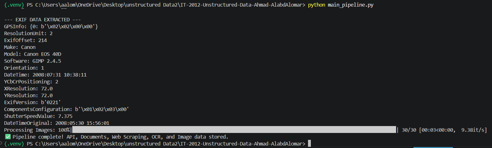
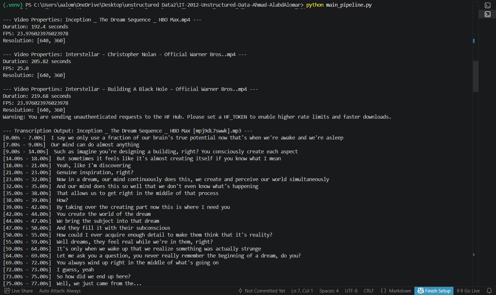
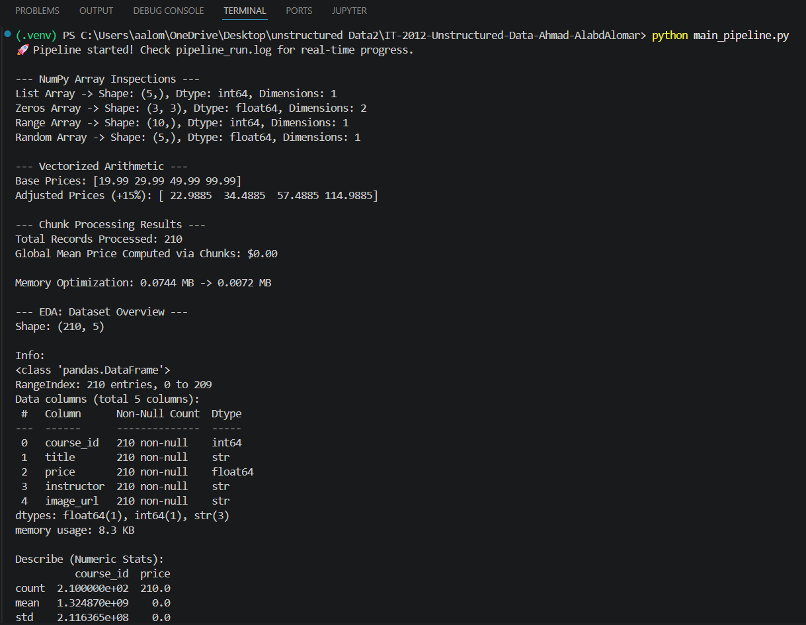
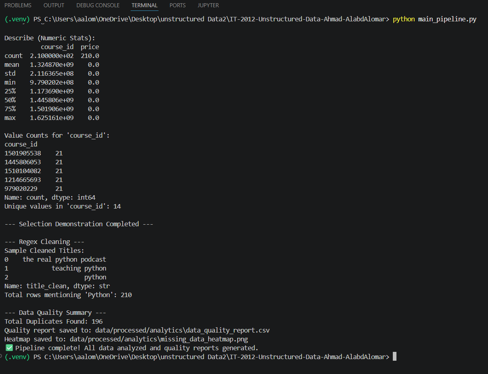

# IT-2012-Unstructured-Data-Ahmad-AlabdAlomar

[Google Drive Link](https://drive.google.com/drive/folders/1D-VKA3y3MAggj5V4xhGMfhhHSurPDLlR?usp=sharing)

 

[notebook with all the running](Lab8_EDA.ipynb)

## Lab 9: Data Cleaning
This lab involved building a robust, automated cleaning pipeline to resolve the issues identified in Lab 8.

- **Cleaning Pipeline:** [src/cleaning/clean_pipeline.py](./src/cleaning/clean_pipeline.py)
- **Unit Tests:** [tests/test_cleaning.py](./tests/test_cleaning.py)
- **Cleaning Notebook:** [notebooks/lab9_data_cleaning.ipynb](./notebooks/lab9_data_cleaning.ipynb)

### Cleaning Results:
- **Missing Values:** Handled via median imputation for numeric data and placeholders for text.
- **Strings:** Normalized whitespace and case formatting across all text columns.
- **Validation:** Integrated `pytest` and `assert` statements to ensure 0% duplicate rate and data integrity.